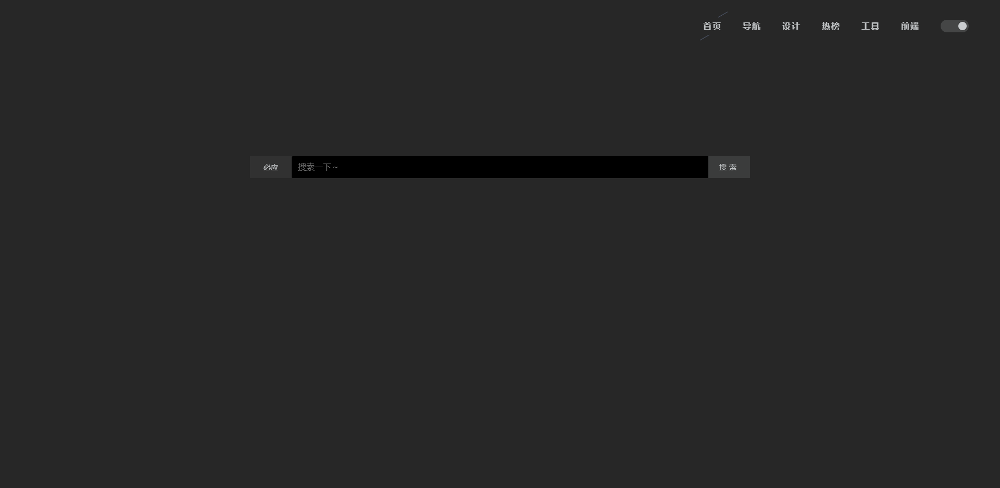
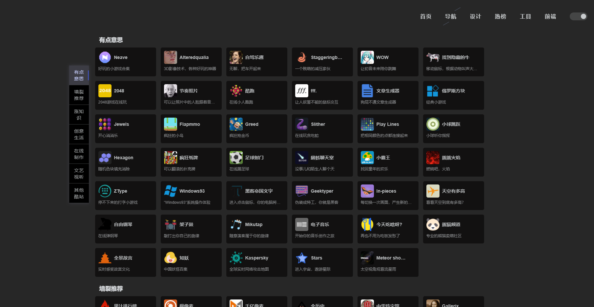

<h1 align="center">home-nav</h1>

<div align="center">
    基于Nuxt.js + koa + MongoDB,一个简洁的导航管理项目
</div>

## 运行
```
yarn
yarn run  dev 
```

## 截图




## 功能
1. 前台功能
- [x] 首页
- [x] 导航链接
- [x] 暗黑模式
- [ ] 提交链接
2. 后台功能
- [x] 登录
- [x] 菜单维护
    - [x] CURD
    - [ ] 导入,导出
- [x] 分类维护
    - [x] CURD
    - [ ] 导入,导出
- [x] 网址维护
    - [x] CURD
    - [ ] 导入,导出
- [ ] 统计分析

## 参与贡献

非常欢迎你的贡献，你可以通过以下方式一起共建 :smiley:：

- 通过 Issue 报告 bug 或进行咨询。
- 提交 Pull Request 改进 home-nav 的代码。